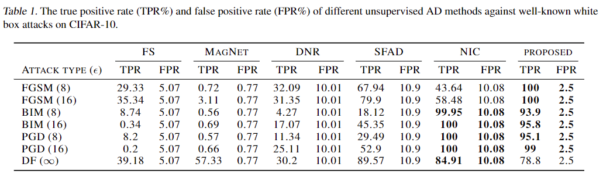

# Unsupervised Adversarial Detection without Extra Model

This project is the source code of "Unsupervised Adversarial Detection without Extra Model: Training Loss Should Change" and is implemented by tensorflow.

The proposed adversarial detection method is the first unsupervised method using only the original classification model (the target model for adversarial attacks), unlike most methods with extra models and weights. We find that the behavior of cross entropy loss creates redundant features and gives more clues for adversarial attacks. Therefore, we change the training loss and train with part of adversarial samples to remove the one-hot output trend. After the proposed training, the classification model can also detect adversarial samples from unknown attack types by only the target model's raw outputs, the outputs before softmax.

The proposed training loss won't decrease the accuracy of the origin classification task, and the overhead of methods with extra model is eliminated. The only overhead is training time, about 1.5 times, but it can be further reduced by decreasing the ratio of adversarial samples or fewer attack updates. We didn't try to reduce training time more because it was low enough.

This project works in Win10, and will work in linux as well in the future.

## Comparison with other unsupervised adversarial detection methods



## Requirement

python==3.8

tensorflow==2.9

adversarial-robustness-toolbox==1.14

tensorflow-datasets==4.8

opencv-contrib-python==4.7

matplotlib==3.5

## Training and the result statistics

Before using the proposed adversarial detection and the corresponding evaluation, all models need to be trained with the proposed training loss.

All parameters needed in training are included in the python code. The proposed training process and all training processes for ablation study are in different python files. They are all inherited from `proto_train.py`, which is the normal training process.

If you want to run the proposed training, just execute:

`python proposed_train.py`

In the training for ablation studies, "no_atk" means that adversarial samples are not included in the training, and "CE" means that common cross entropy loss is included but multi-hot KL divergence loss for true outputs is removed. In all training except `proto_train.py`, uniform KL Divergence loss for false outputs is included.

After training, a directory is created in "./train/" based on the training process (*train_dir* for example). The model weight is saved in "./train/*train_dir*/ckpt/", and the built-in statistics is in "./train/*train_dir*/statistics/". The built-in statistics is the histogram of raw outputs under different condition, such as "true or false output" and "whether the answer is correct".

It has to mention that `pilot_train_no_atk_CE.py` is a pilot study used in the paper. This pilot study find that constraining false raw outputs to the same value helps defend against the PGD attack with L1 loss to false raw outputs, but one-hot output trend and cross entropy loss stop this training set from working well. This pilot study is mentioned in the chapter 3.2 of the paper.

## Adversarial detection evaluation

Before evaluating adversarial detection, the corresponding training should be executed. After training, the evaluation is separated into two parts, generating adversarial data and testing. The adversarial data is generated by:

`python art_adv_data_generator.py`

And then tested by:

`python art_data_metric.py`.

The required setting is included in `art_adv_data_generator.py`, like the following code:

```python
if __name__ == "__main__":
    # global info
    dataset_name = "cifar10"
    weight_name = "MyResnet cifar10 proposed"
    config_dir = "./art_data_config/" 
    config_name = "main" # the config of main and ablation are different.
    weight_dir = "./train/"+weight_name+"/"
    weight_epoch = 59
    weight_path = weight_dir+"ckpt/"+str(weight_epoch)
```

Model's weight is chosen by "weight_name" (the *train_dir* mentioned in "Training and model's raw output distributionthe previous exsampl"), and the configuration for adversarial attack is chosen by "config_name". There are two configurations in "./art_data_config". The `main.json` outputs the adversarial samples for main comparison table, and the `ablation.json` outputs the adversarial samples for ablation study. The model's weight from different epochs can be chosen by "weight_epoch", and the default is the last one (59).

After the adversarial data is generated, model weight and the adversarial data should be chosen for evaluation. The "weight_name" and "config_name" in `art_adv_data_generator.py` and `art_data_metric.py` should be the same.

The evaluation will be saved in directory like:

* ./test/cifar10/"weight_name"/"config_name"/statistics/

The evaluations for different attacks are separatly saved in directories named after attacks. In the directory, the evaluation is saved in `metric.txt` and the histogram for raw outputs is saved in `raw_distrbution.png`. The evaluation will compute the AUROC, AUPR, FPR95 for the detection with only the maximum threshold, and compute TPR and FPR for the maximum threshold (with prefix "max_detect_") and both thresholds (with prefix "both_detect_").

## Customized adversarial detection evaluation

Except known attack types, we also test adversarial detection with some custom attack loss (PGD attack) in `adv_atk_detect_metric.py`. The default attack loss is reverse L1 loss for each raw output and reverse cross entropy loss. The attack loss can be changed by replacing "grad_func", and the model output can be also chosen by "grad_func_output".

## Using customized model

For training, customize model like the following example:

```python
#set up model
train_handle = TrainHandle(class_count=num_classes, input_shape=input_shape, model=custom_model)
```

The "custom_model" should be tensorflow subclass model with number of classes as argument, and output should be in the order of softmax outputs, maximum output index, and raw outputs.

For adversarial detection evaluation, replacing "MyResnet" with the customized model.

## Using different dataset

This project uses tensorflow datasets. If you want to change datasets, just change "dataset_name" from "cifar10" to the dataset you want. The dataset should be supported by [tensorflow datasets](https://www.tensorflow.org/datasets/catalog/overview#all_datasetshttps:/).

## Citation
